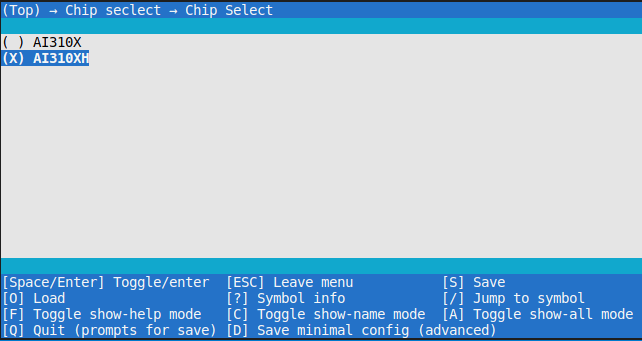
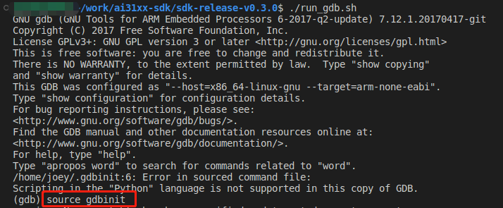
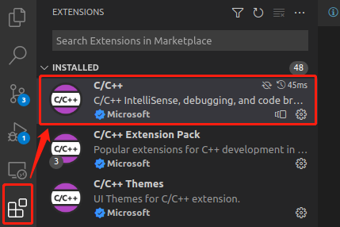
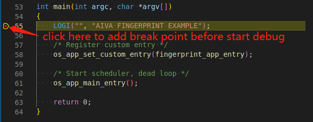
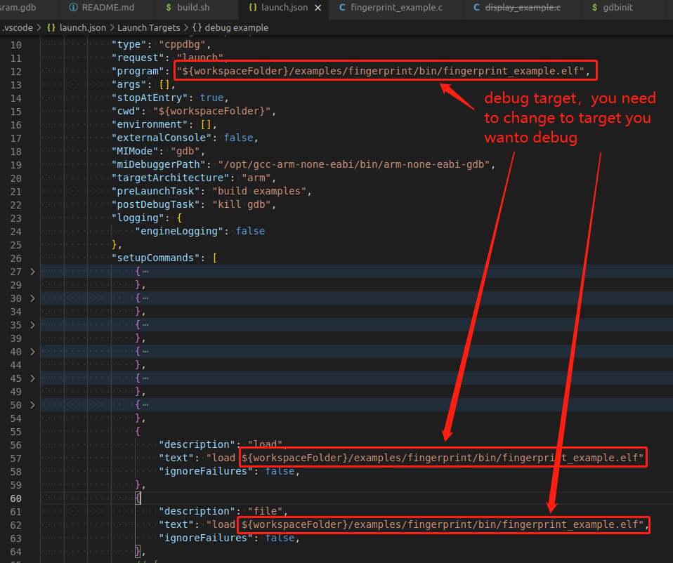
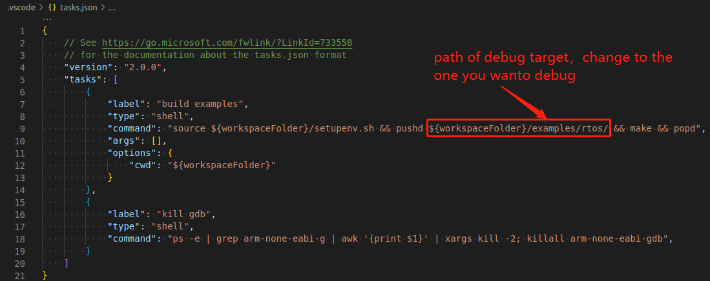
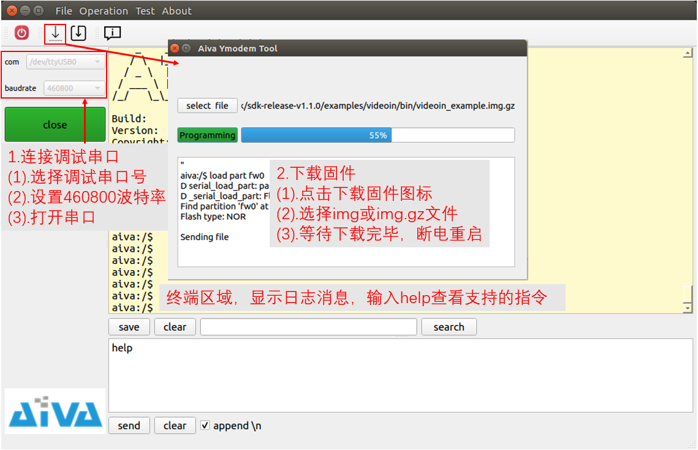

# ai31xx-sdk quick start

## 1. prepare environment

### (1) setup cross compile environment

- download linux version of cross compile toolchain [gcc-arm-none-eabi-6-2017-q2-update](https://developer.arm.com/tools-and-software/open-source-software/developer-tools/gnu-toolchain/gnu-rm/downloads/6-2017-q2-update)

- install cross compile toolchain into folder `/opt/gcc-arm-none-eabi`

> you may need to rename toolchain folder name from `gcc-arm-none-eabi-6-2017-q2-update` to `gcc-arm-none-eabi` or make soft link. make sure toolchain folder has following directory structure

```bash
/opt/gcc-arm-none-eabi/
├── arm-none-eabi
├── bin
├── gcc-arm-none-eabi -> ./gcc-arm-none-eabi
├── lib
└── share
```

### (2) setup JLink Server

- download [JLink server](https://www.segger.com/downloads/jlink/)

- install JLink server into folder `/opt/SEGGER/JLink`

### (3) setup AI31XX-EVB

- connect AI31XX Evaluation Board as following: use 12V power adpater; connect JLink to PC and start JLink server

- connect UART device to UART0 debug serial to see log message of application


## 2. build example

- change to example folder which you want to build and build example

```bash
source setupenv.sh # setup env
cd examples/rtos # change to rtos example folder
```

- select correct chip by run `make menuconfig`


- build example

```bash
make clean && make # build rtos example
```

## 3. debug use gdb

connect module to PC and start jlink and gdb

```bash
# start jlink server
./run_jlink.sh # change to sdk root directory and run jlink script
# open another shell and start gdb
./run_gdb.sh
```

source gdbinit to download firmware and start debug use gdb


```bash
source gdbinit # type source gdbinit in gdb window, after download firmware you can use gdb to debug
```

## 4. debug use vscode (optional)

> you should build with debug mode (`CONFIG_DEBUG=y`) which can be set by run make menuconfig in project root if you want to debug use vscode

start jlink server

```bash
# start jlink server
./run_jlink.sh
```

install c++ debug plugin of vscode



add break point



`press F5` to start debug; scripts in .vscode will download firmare and start debug

> you can change debug target at .vscode/launch.json



> and you can change default build task at .vscode/launch.json


## 5. check log message and download firmware use [aiva-debug-tool extract code: aiva](https://pan.baidu.com/s/1GgQCYckZGgYJliBEERgjPA)

- connect uart device to UART0 debug serial of EVB board, then open this UART device use aiva-debug-tool


