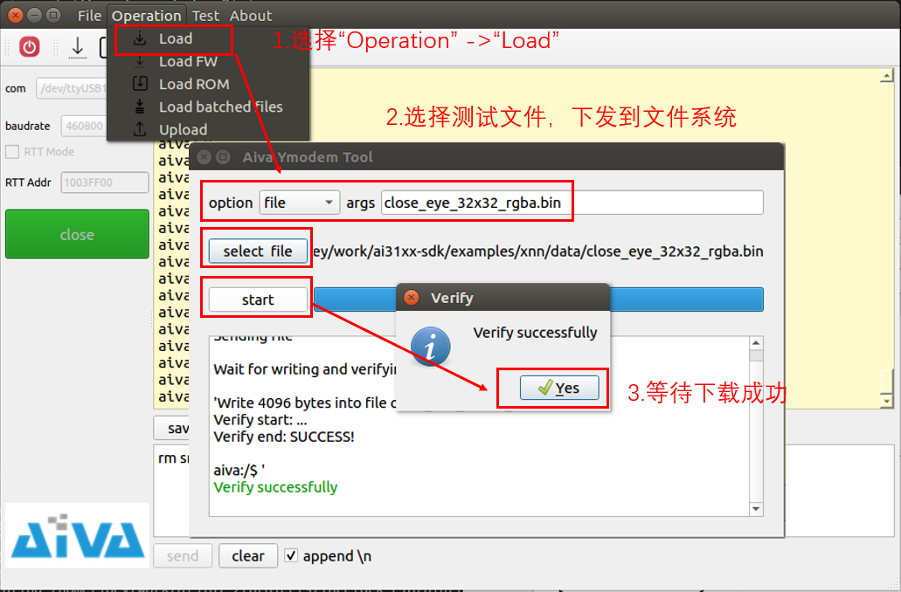
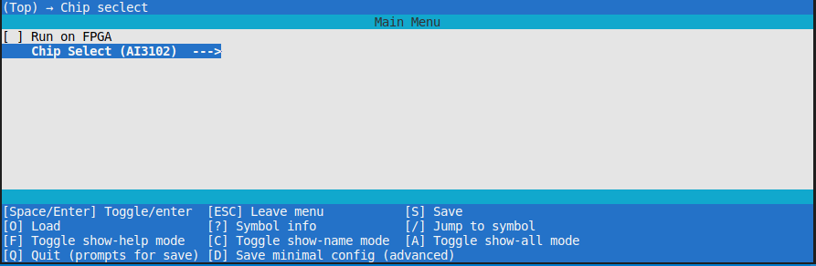
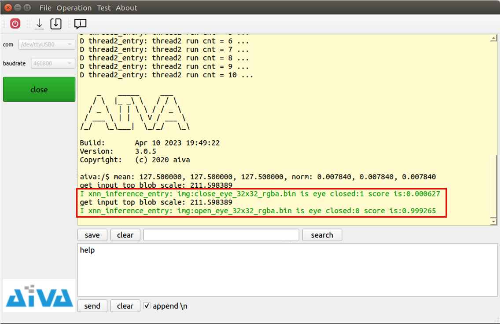

# xnn inference example

## 1. download test files to file system



> read xnn_inference.cpp to make sure all test data are downloaded to device

## 2. config exmaple by `make menuconfig`



> you should select correct chip according to chip on your EVB board

## 3. build example and check xnn inference result

```bash
make clean && make # build exmaple
```

> refer this [document](./../../README.md) to see how to debug your application


